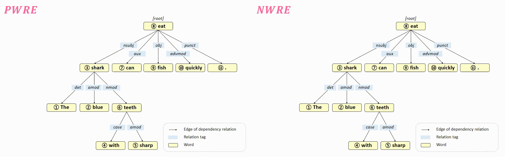

# RWEN-TTS: Relation-aware Word Encoding Network for Natural Text-to-Speech Synthesis

- Implements the model described in the following paper "[RWEN-TTS: Relation-aware Word Encoding Network for Natural Text-to-Speech Synthesis](https://arxiv.org/abs/2212.07939)" (AAAI 2023).

## An example of SRE (gif)

## An example of AWRE (gif)

## Our Codes
Due to the policy of our previous company, our codes are partially released.

We have only released core codes of RWEN except the TTS Model (e.g. fastpitch).

However, released codes related to our contributions are included in the src folder and includes the dataset function, collate function, and model class for easy integration into the TTS Model.

Codes are based on the [fastpitch 1.1 repository](https://github.com/NVIDIA/DeepLearningExamples/tree/master/PyTorch/SpeechSynthesis/FastPitch) and could be reproducible with proper integration of that repo and our source.

Since RWEN needs text processing by phonemes, we need to take this into account. For example, for the fastpitch 1.1 repository, use english_cleaners_v3 function from src/common/cleaners.py and english_phonemized from src/common/symbols.py.
